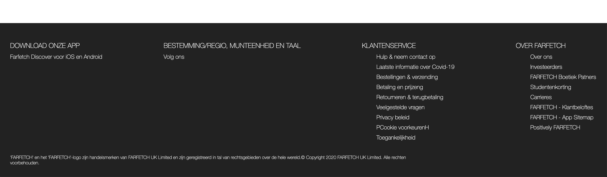

# Procesverslag
**Auteur:** -jouw naam-

Markdown cheat cheet: [Hulp bij het schrijven van Markdown](https://github.com/adam-p/markdown-here/wiki/Markdown-Cheatsheet). Nb. de standaardstructuur en de spartaanse opmaak zijn helemaal prima. Het gaat om de inhoud van je procesverslag. Besteedt de tijd voor pracht en praal aan je website.

## Bronnenlijst
1. -bron 1-
2. -bron 2-
3. -...-

## Eindgesprek (week 7/8)

-dit ging goed & dit was lastig-

**Screenshot(s):**

-screenshot(s) van je eindresultaat-

## Voortgang 3 (week 6)

### Agenda voor meeting

-Bespreking met Vasilis van Gemert, groep 2-

### Stand van zaken
-Eindelijk  de Header/navigatie plus de footer werkende. Wel had ik de Footer heel omslachtig gemaakt en heb ik dit met Romy Wiedijk besproken. Waarna ik de footer toch weer opnieuw ben gaan opzetten om het allemaal wat netter te maken.-

### Verslag van meeting
-Voor mijn eigen gevoel was ik wel redelijk goed op weg, aangezien mijn kennis niet heel groot is. Was ik al trots dat dit er stond. Nu was het de opdracht om alles in de Main nog goed te positioneren en de juiste styling te geven. Tevens ook voor de tweede pagina.-

## Voortgang 2 (week 5)

-same as voortgang 1-

## Voortgang 1 (week 3)

### Stand van zaken

-Wat ging er niet mis. Ik merk dat ik het allemaal heel lastig vind. Waar moet ik beginnen? Ik ben maar begonnen met de header oftewel de navigatie. Wat allemaal niet  zo gemakkelijk ging. Ik heb het dus ook nog niet voor elkaar.-

**Screenshot(s):**

### Agenda voor meeting

-Bespreking met Romy Wiedijk en Jo-ann Lieuw-A-Peuw, groep 2-

### Verslag van meeting

-Het blijkt wel dat ik nog veel moet doen, had alleen een incomplete navigatie te laten zien. Het advies aan mij was dan ook, staar je er niet blind op en ga anders eerst even door met iets anders en pak later die navigatie dan weer op.-

## Intake (week 1)

**Je startniveau:** - Ik zit echt op de blauwe piste, ik merk wanneer iemand het mij uitlegd dat ik het begrijp maar wanneer ik zelf ergens moet starten ben ik  al snel de weg kwijt. -

**Je focus:** - Ik ga mij focussen op het responsive maken van de website -

**Je opdracht:** - https://www.farfetch.com/nl/shopping/women/items.aspx -

**Screenschots**

**Breakdown-schets(en):**

