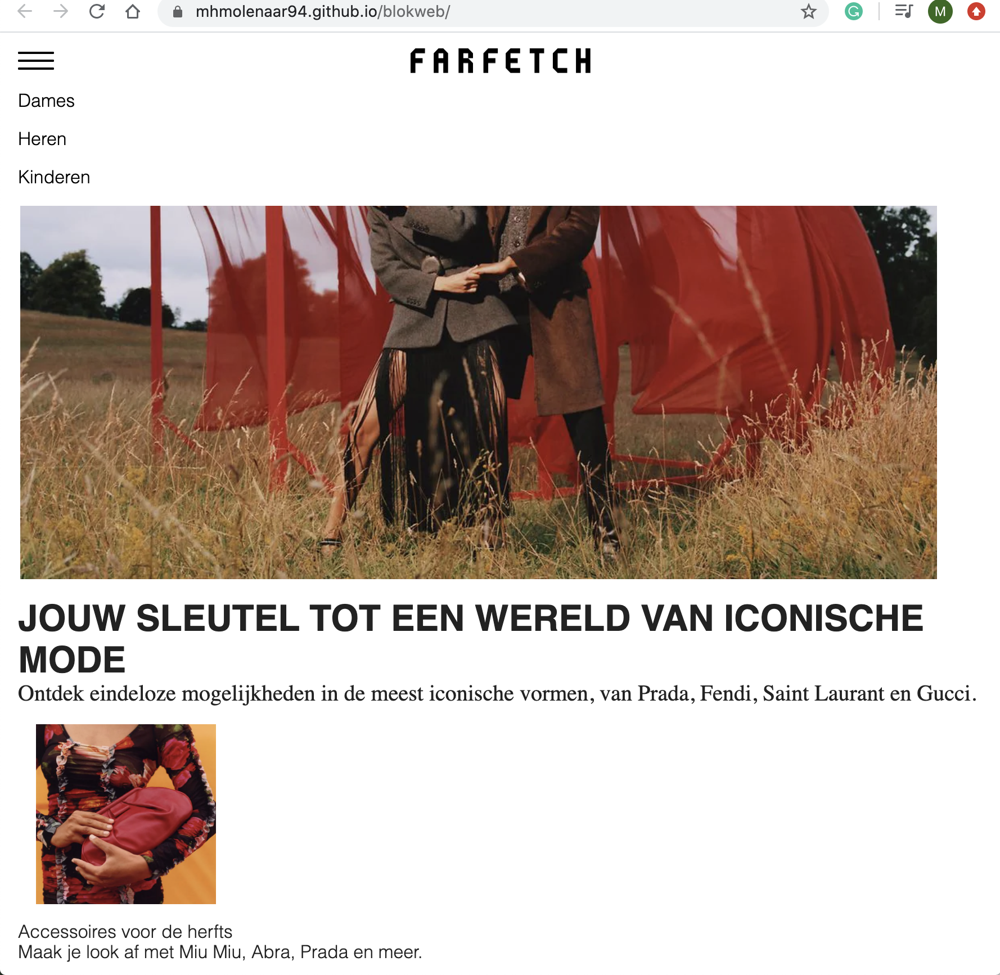
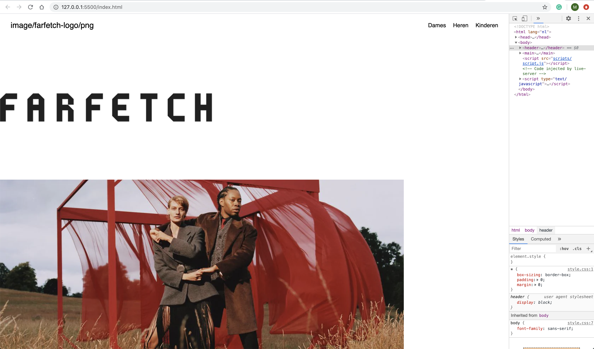

# Procesverslag
**Auteur:** -jouw naam-

Markdown cheat cheet: [Hulp bij het schrijven van Markdown](https://github.com/adam-p/markdown-here/wiki/Markdown-Cheatsheet). Nb. de standaardstructuur en de spartaanse opmaak zijn helemaal prima. Het gaat om de inhoud van je procesverslag. Besteedt de tijd voor pracht en praal aan je website.

## Bronnenlijst
1. -https://www.w3schools.com/howto/howto_css_images_side_by_side.asp 
voor het netjes naast elkaar zetten van images.-
2. -https://www.w3schools.com/w3css/w3css_tabulators.asp + https://www.youtube.com/watch?v=v6-4wh_o9iM 
voor het maken van de tab sectie op pagina 2.-
3. -https://www.w3schools.com/css/css_dropdowns.asp 
voor de dropdown op pagina 2.-
4. -https://markus.oberlehner.net/blog/super-simple-progressively-enhanced-carousel-with-css-scroll-snap/
voor de carousel met prodcuten op pagina 1.-
5. -https://www.html.am/html-codes/image-codes/html-favicon-code.cfm 
voor het toevoegen van de favicon.-
6. -https://www.youtube.com/watch?v=8QKOaTYvYUA 
voor de header/navigatie.-
7. https://css-tricks.com/snippets/css/a-guide-to-flexbox/ 
voor flexbox.-

8. -https://zellwk.com/blog/how-to-write-mobile-first-css/ 
https://www.handleidinghtml.nl/css/css-oud/position.htm
om in de stof (html/css/js) te komen.-

9. -https://www.farfetch.com/nl/shopping/women/items.aspx website die ik heb gebruikt voor de opdracht.-

## Eindgesprek (week 7/8)

-Ik heb veel tijd en energie in dit vak gestoken. Ik merkte dat ik echt weer vanaf nul moest beginnen, omdat het toch al wel weer een aantal jaren geleden was dat ik had geprogrammeert. Ik vond het positioneren een van de lastigste stukken. Vooral de afbeeldingen waren soms koppig. Wat ik ook heb geleerd is eerder hulp vragen, inplaats van zelf alles willen oplossen. Dit had mij in het begin veel tijd kunnen besparen. De responsive elementen plus de beweegbare elementen (carousel) vond ik ook lastig.-

**Screenshot(s):**

-screenshot(s) van je eindresultaat-

## Voortgang 3 (week 6)

### Agenda voor meeting

-Bespreking met Vasilis van Gemert, groep 2-

### Stand van zaken
-Eindelijk  de Header/navigatie plus de footer werkende. Wel had ik de Footer heel omslachtig gemaakt en heb ik dit met Romy Wiedijk besproken. Waarna ik de footer toch weer opnieuw ben gaan opzetten om het allemaal wat netter te maken. Ook zijn de header en de navigatie nu responsive.-

### Verslag van meeting
-Voor mijn eigen gevoel was ik wel redelijk goed op weg, aangezien mijn kennis niet heel groot is. Was ik al trots dat dit er stond. Nu was het de opdracht om alles in de Main nog goed te positioneren en de juiste styling te geven. Tevens ook voor de tweede pagina.-

## Voortgang 2 (week 5)

### Stand van zaken

-Ik heb mij toch vast gebeten op de header/navigatie. Ik ben een persoon die graag eerst het eene klaar heeft voordat ze door gaat met het andere nu merkte ik wel dat dit misschien wel teveel tijd in beslag heeft genomen. Dit is ook mijn valkuil, maar anders had het in mijn hoofd blijven rondspoken. Nu ik tevreden ben over de navigatie heb ik ook alvast de content toegevoegd aan de main, die ik wil uit gaan werken.-

**Screenshot(s):**

### Agenda voor meeting

-Monika heeft deze beoordeling over genomen, groep 2-

### Verslag van meeting

-Uit de beoordeling bleek wel dat ik nog steeds veel te doen heb, ik moet mij er dus goed invast gaan bijten.-

## Voortgang 1 (week 3)

### Stand van zaken

-Wat ging er niet mis. Ik merk dat ik het allemaal heel lastig vind. Waar moet ik beginnen? Ik ben maar begonnen met de header oftewel de navigatie. Wat allemaal niet  zo gemakkelijk ging. Ik heb het dus ook nog niet voor elkaar.-

**Screenshot(s):**

### Agenda voor meeting

-Bespreking met Romy Wiedijk en Jo-ann Lieuw-A-Peuw, groep 2-

### Verslag van meeting

-Het blijkt wel dat ik nog veel moet doen, had alleen een incomplete navigatie te laten zien. Het advies aan mij was dan ook, staar je er niet blind op en ga anders eerst even door met iets anders en pak later die navigatie dan weer op.-

## Intake (week 1)

**Je startniveau:** - Ik zit echt op de blauwe piste, ik merk wanneer iemand het mij uitlegd dat ik het begrijp maar wanneer ik zelf ergens moet starten ben ik  al snel de weg kwijt. -

**Je focus:** - Ik ga mij focussen op het responsive maken van de website -

**Je opdracht:** - https://www.farfetch.com/nl/shopping/women/items.aspx -

**Screenschots**

**Breakdown-schets(en):**

